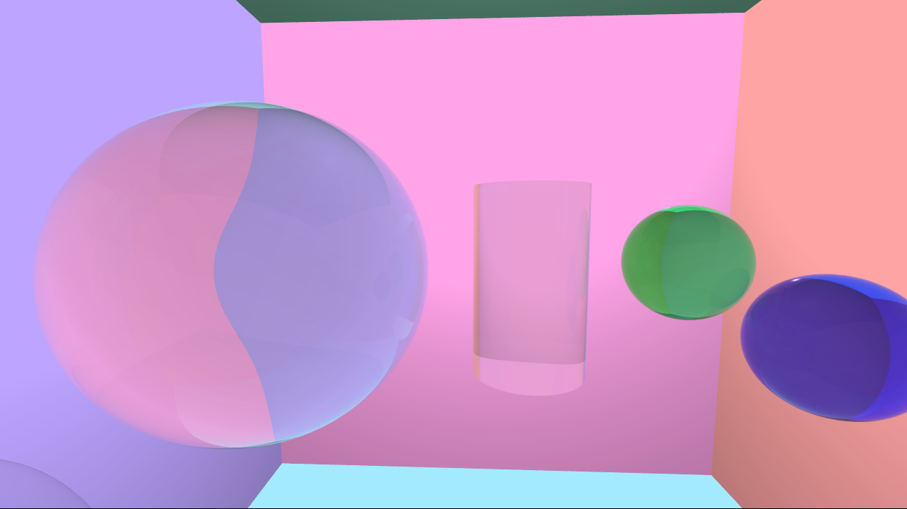
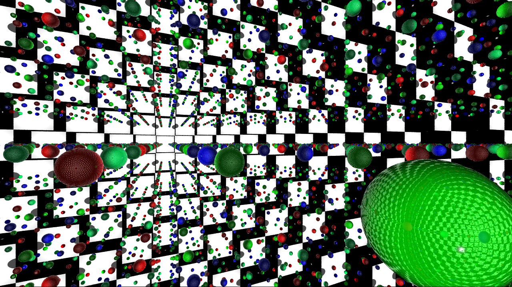
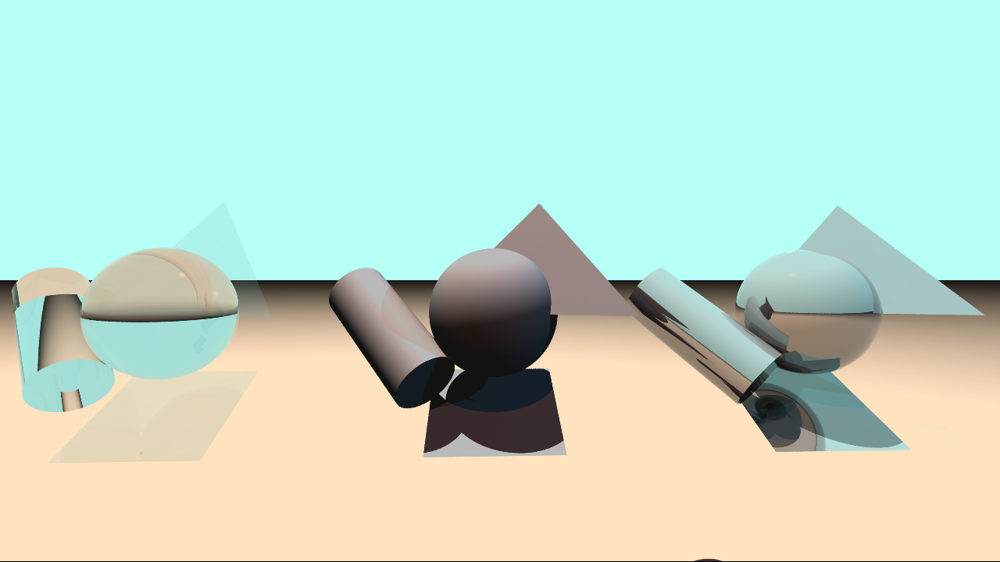
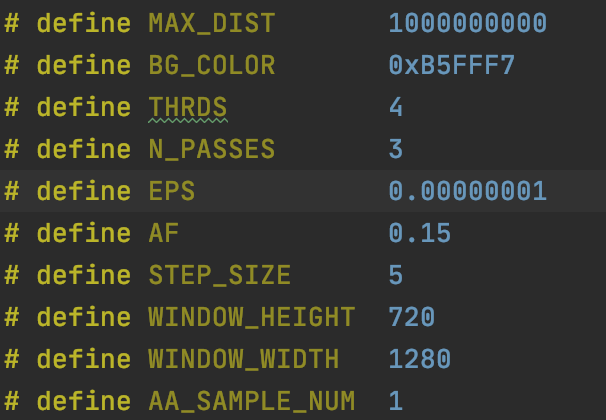

# miniRT

## Introduction

miniRT is a minimalist raytracer application which visualizes basic shapes in 3d-space from a given scene and implements a number of basic raytracing features as well as other nifty additions. 

Objects included:
- Ambient Light
- Light
- Camera
- Triangle
- Square
- Sphere
- Plane
- Cylinder

Features included:
- Reflectivity
- Specular
- Transparency
- Refraction
- Multiple Cameras
- Camera Movement
- Multi-threaded Rendering
- Anti-aliasing
- In-app Screenshots (BMP format)
- Colored lights

## Installation

1. Clone this git repository.
2. Execute the command `make` in the root directory to compile the application.
3. Voila! You can now show off this mediocre raytracer application to your grandparents while they tell you about how easy you have it.

## Usage

This app is launched through the command line with additional arguments in the following way: `./miniRT {Path to scene} {optional '--save' argument}` e.g. `./miniRT ./scenes/vistavka1.rt`.
\
\
This should launch a window displaying the rendered image of the scene provided. This repository already contains a few scenes that you can try out. Alternatively, you can make your own! See the 'Scene File Format' section for an overview of the scene file format. Adding the optional '--save' argument will render and save the scene as seen by the camera (first one if theres more than one) as a bmp image.

### Scene File Format
Scene files have a '.rt' extension and all the specifications for '.rt' scenes are detailed in the [project pdf](miniRT.pdf).
### Controls
#### Camera Controls:
- WASD keys to move forward, left, back, and right.
- E/ Space to go up/ down.
- Arrow keys to rotate the camera.
- M/ N keys to switch to next/previous camera.
- B key to take a screen shot from the currently selected camera's perspective.

#### Parameter Controls:

To control things such as the scene background color, maximum number of threads allowed for multithreading, anti-aliasing sampling size, you need to open the 'minirt.h' file and manually change the numbers in the fields that relate the specified feature you want to affect, then recompile the app using the `make` command. I know this is a bit clunky and inefficient, but it's my first proper project, c'mon.

Parameters:
- BG_COLOR color of the background/ sky (hexadecimal format 0xRRGGBB)
- THRDS maximum number of threads permitted for multi-threading
- N_PASSES the maximum number of times a camera ray can bounce of an object (affects reflective and translucent/ transparent objects)
- WINDOW_HEIGHT height (in pixels) of display window
- WINDOW_WIDTH width (in pixels) of display window
- AA_SAMPLE_NUM anti-aliasing sample size
